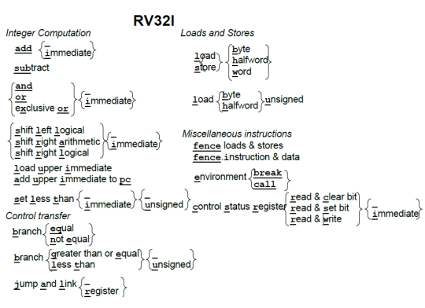

# 
  RISC-V 

## 目录
+ [基础概念](#基础概念)
+ [RISC-V架构](#risc-v-架构)
    + [模块化的指令集](#模块化的指令集)
    + [通用寄存器组](#通用寄存器组)
    + [risc-v存储器访问指令](#risc-v存储器访问指令)
    + [跳转指令](#跳转指令)
    + [子程序调用](#子程序调用)
    + [risc-v指令运算](#risc-v指令运算)
    + [特权模式](#特权模式)
    + [csr寄存器（control-and-status-register）](#csr寄存器（control-and-status-register）%3A控制和状态寄存器)

## 基础概念

> 基础概念1： 处理器架构的位数是指通用寄存器的宽度，且处理器指令集架构的宽度和指令的编码长度无关系
>
> RISC：精简指令集（Reduced Instruction Set Computer） RISC-V: 是伯克利发明的一种特定指令集架构（属于 RISC 类型〉。

> 基础概念2：
>> + 通用寄存器的宽度，即指令集架构位数越多越好，可以带来更大的寻址范围和更强的运算能力
>> + 指令编码的长度越短越好，节省代码存储空间 
> 基础概念3：ARM Cortex分类
>> + Cortex-A: 面向性能密集型系统，如手机、电脑（操作系统）
>> + Cortex-M: 面向各种嵌入式应用的微控制器核，如智能家居、各种物联网设备、MCU（嵌入式）
>> + Cortex-R：面向实时应用的高性能核，（实时）
> 基础概念4： CPU 处理器 处理器核 Core的区别：处理器核和Core是指处理器内部最核心的部分，是真正的处理器内核；而处理器和CPU往往是一个完整的SoC，包含了处理器内核和其他的设备或者存储器。

## RISC-V 架构
&emsp;&emsp; RISC-V的特点就在于**极简、模块化、可定制扩展**
### 模块化的指令集
+ RISC-V架构的指令数目十分简洁，基本RISC-V指令数目仅有40多条，加上其他模块化扩展指令总共几十条。
+ RISC-V 每个模块用英文字母表示
    + 最基本且强制要求实现的是 **I** 字母表示的基本整数指令子集,其他还包括M/A/F/D/C

    |扩展指令集|指令数|                    描述                       | 
    |:----------:|:------:|:------------------------------------------|
    | M |   8  | 整数乘法与除法指令|
    | A |  11  |存储器原子（Atomic）操作指令和Load-Reserved/Stroe-Conditional指令|
    | F |  26  |单精度（32bit）浮点指令|
    | D |  26  |双精度（64bit）浮点指令，必须支持F扩展指令|
    | C |  46  |压缩指令，指令长度为16位|

+ 以上模块有一个特定组合，IMAFD，被称为通用组合，用字母**G**表示,如RV32G表示RV32IMAFD
+ C指令集为了提高代码密度，指令长度为16位，普通为32位
+ 为了减少面积，RISC-V还提供”嵌入式“架构，字母E表示，仅需要支持16个通用整数寄存器，普通的需要32个。

### 通用寄存器组
+ RISC-V 支持32位或64位架构，RV32 RV64分别代表通用寄存器宽度为32位、64位。
+ RISC-V 架构的整数通用寄存器组，包含32个（I架构）或16个（E架构）通用整数寄存器，寄存器0被预留为常数0
+ 使用浮点模块F或D，则需要另外一个独立的浮点寄存器组, F的寄存器32位，D的64位

### RISC-V存储器访问指令
+ 推荐使用地址对齐的存储器读写操作， 也支持地址非对齐的存储器操作
+ 仅支持小端
+ 存储器读写指令不支持地址自增自减
+ 采用松散存储器模型， 对于访问不同地址存储器读写指令的执行顺序不作要求，除非用屏障指令屏蔽。

### 跳转指令
+ 无条件跳转指令（unconditional jump）
    + jal(jump and link)：用于子程序调用，同时将子程序返回地址保存在链接寄存器（link register）
    + jalr (jump and link-register)可以从子程序返回
+ 有条件跳转指令：使用两个整数操作数，进行比较,比较结果满足则进行跳转。
    + beq，bne，blt，bltu，bge，bgeu: 例如 beq rs1, rs2, label
        + beg 令只有在操作数寄存器 rs1 中的数值与操作数寄存器 rs2 中的数值相 时，才会跳转
        + bne 指令只有在操作数寄存器 rs1 中的数值与操作数寄存器 rs2 中的数值不相等时，才会跳转。
        + bit 指令只有在操作数寄存器 rs1 中的有符号数小于操作数寄存器 rs2 中的有符号数时，才会跳转
        + bltu 指令只有在操作数寄存器 rs1 中的无符号数小于操作数寄存器 rs2 中的无符号数时，才会跳转
        + bge 指令只有在操作数寄存器 rs1 中的有符号数大于或等于操作数寄存器 rs2 中的符号数时，才会跳转
        + bgeu 指令只有在操作数寄存器 rs1 的无符号数大于或等于操作数寄存器 rs2 中的无符号数时，才会跳转
+ 跳转的静态分支预测机制，动态分支预测机制。

### 子程序调用
+ 进入子函数后，用存储器写（store）保存当前上下文到系统存储器堆栈区中，此过程称为保存现场
+ 退出子函数时，用存储器读（load）从系统存储器堆栈区读出之前保存的上下文，此过程称为恢复现场
+ RISC-V 放弃使用一次读多个（Load Multi）或一次写多个（Store Multi）寄存器指令。

### RISC-V指令运算
+ 运算指令产生错误时，不会产生软件异常，而是产生某个特殊的默认值，同时设置某些状态寄存器的状态位。（推荐软件从其他方法找到这些错误）

### 特权模式
+ Machine Mode：机器模式（必选模式）
+ Supervisor Mode：监督模式
+ User Mode： 用户模式
+ RISC-V 架构也支持不同的存储器地址管理机制（MMU），包括对于物理地址和虚拟地址的管理机制。

### CSR寄存器（Control and Status Register）:控制和状态寄存器
+ CSR寄存器访问专用CSR指令， CSRRW, CSRRS, CSRRC, CSRRWI, CSRRSI 以及 CSRRCI 指令:
    + csrrw 指令完成两项操作：csrrw rd, csr, rs1
        + 将csr 索引的 CSR 寄存器值读出，写回结果寄存器 rd
        + 将操作数寄存器 rsl 中的值写入 csr 索引的 CSR 寄存器中。
    + csrrs 令完成两项操作
        + 将csr 索引的 CSR 存器值读出，写回结果寄存器 rd
        + 以操作数寄存器 rs1 值逐位作为参考，如果 rs1 中的值某个bit位为 1，则将csr索引的CSR寄存器中对应的比特位置清为0,其他位则不受影响
    + csrrc 指令完成两项操作：
        + 将csr 索引的 CSR 寄存器的值读出，写回结果寄存器 rd 中。
        + 以操作数寄存器 rs1 中的值逐位作为参考，如果 rs1 中的值某个比特位为1 ，则将csr索引的CSR寄存器中对应的比特位清为0, 其他位不受影响。
    + csrrwi 令完成两项操作： csrrwi rd, csr, imm[4 : 0]
        + csr 索引的 CSR 寄存器的值读出，写回结果寄存器 rd
        + 将5位立即数（高位补0 扩展〉的值写入 csr 索引的 CSR 寄存器中。
    + csrrsi 令完成两项操作
        + csr 索引的 CSR 寄存器的值读出，写回结果寄存器 rd 中。
        + 将5位立即数（高位补0 扩展〉的值逐位作为参考，如果rs1中的值某个比特位为 1,csr 索引的 CSR 寄存器中对应的比特位置清为0，其他位则不受影响
    + csrrci 令完成两项操作：
        + csr 索引的 CSR 寄存器的值读出，写回结果寄存器 rd 中。
        + 将5位立即数（高位补0扩展）的值逐位作为参考，如rs1中的值某个比特位为 1, csr 索引的 CSR 寄存器中对应的比特位清为0，其他位则不受影响。

## RISC-V整数指令集
+ set less than {immediate} {unsigned}:表示RV32I指令中的：slt slti sltu sltiu
+ RV32I的六种指令格式：
    + 用于寄存器-寄存器操作的 R 类型指令
    + 用于短立即数和访存 load 操作的 I 型指令
    + 用于访存 store 操作的 S 型指令
    + 用于条件跳转操作的 B 类型指令
    + 用于长立即数的 U 型指令
    + 用于无条件跳转的 J 型指令

+ 所有位全是0/1的RV32I是非法指令(跳转被清零的内存区域会触发异常)
