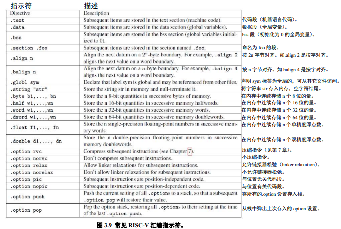
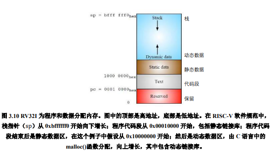
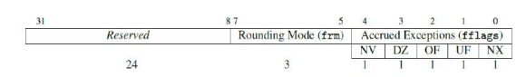
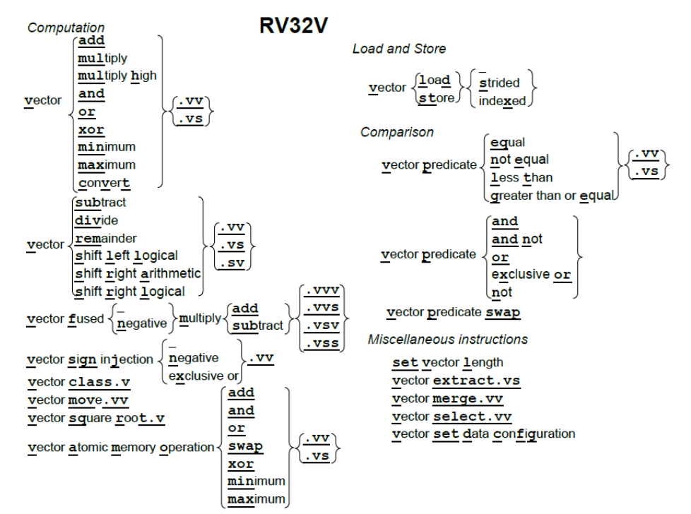
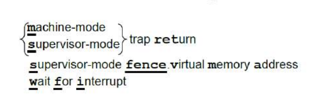
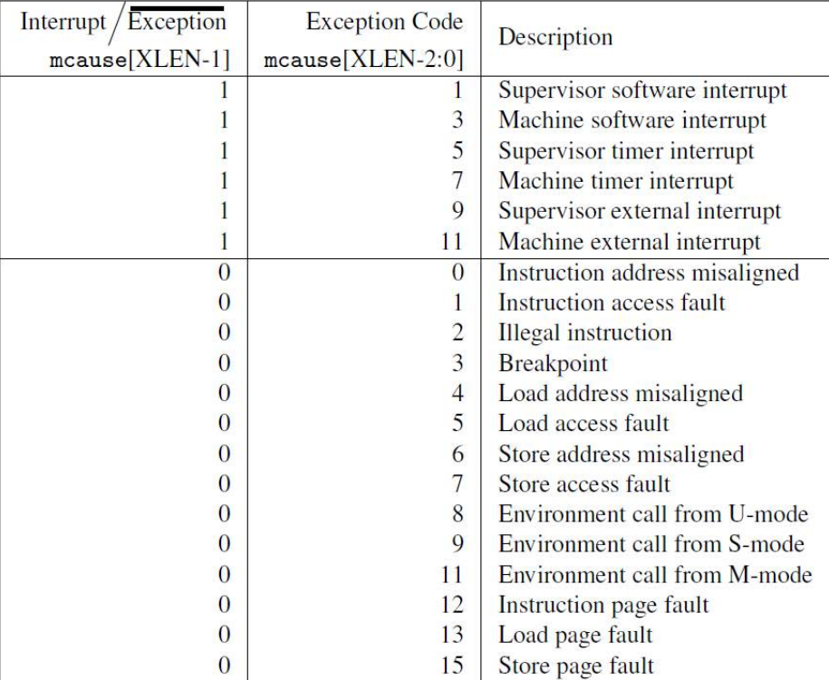
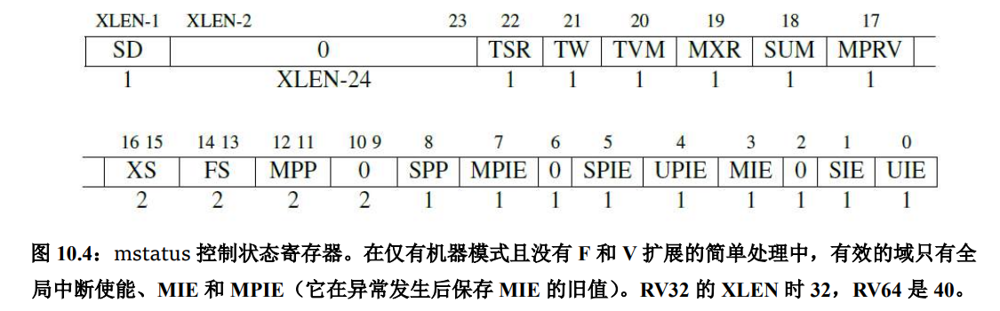

# <center>  RISC-V </center>

## 目录
+ [基础概念](#基础概念)
+ [RISC-V架构](#risc-v-架构)
    + [模块化的指令集](#模块化的指令集)
    + [通用寄存器组](#通用寄存器组)
    + [risc-v存储器访问指令](#risc-v存储器访问指令)
    + [跳转指令](#跳转指令)
    + [子程序调用](#子程序调用)
    + [risc-v指令运算](#risc-v指令运算)
    + [特权模式](#特权模式)
    + [csr寄存器（control-and-status-register）](#csr寄存器（control-and-status-register）%3A控制和状态寄存器)
+ [RISC-V指令集](#risc-v指令集)
    + [RISC-V整数指令集](#risc-v整数指令集)
        + [软件检查溢出](#软件检查溢出)
    + [寄存器](#寄存器)
    + [RV32M](#rv32m)
    + [RV32D与RV32F](#rv32d与rv32f)
    + [RV32A原子指令](#rv32a原子指令)
    + [RV32V向量](#rv32v向量)
    + [特权架构](#特权架构)
    + [TES](#tes(trusted-execution-state)架构)
+ [疑问合集](#疑问合集)

## 基础概念

> 基础概念1： 处理器架构的位数是指通用寄存器的宽度，且处理器指令集架构的宽度和指令的编码长度无关系
>
> RISC：精简指令集（Reduced Instruction Set Computer） RISC-V: 是伯克利发明的一种特定指令集架构（属于 RISC 类型〉。

> 基础概念2：
>> + 通用寄存器的宽度，即指令集架构位数越多越好，可以带来更大的寻址范围和更强的运算能力
>> + 指令编码的长度越短越好，节省代码存储空间 
> 基础概念3：ARM Cortex分类
>> + Cortex-A: 面向性能密集型系统，如手机、电脑（操作系统）
>> + Cortex-M: 面向各种嵌入式应用的微控制器核，如智能家居、各种物联网设备、MCU（嵌入式）
>> + Cortex-R：面向实时应用的高性能核，（实时）
> 基础概念4： CPU 处理器 处理器核 Core的区别：处理器核和Core是指处理器内部最核心的部分，是真正的处理器内核；而处理器和CPU往往是一个完整的SoC，包含了处理器内核和其他的设备或者存储器。

## RISC-V 架构
&emsp;&emsp; RISC-V的特点就在于**极简、模块化、可定制扩展**
### 模块化的指令集
+ RISC-V架构的指令数目十分简洁，基本RISC-V指令数目仅有40多条，加上其他模块化扩展指令总共几十条。
+ RISC-V 每个模块用英文字母表示
    + 最基本且强制要求实现的是 **I** 字母表示的基本整数指令子集,其他还包括M/A/F/D/C

    |扩展指令集|指令数|                    描述                       | 
    |:----------:|:------:|:------------------------------------------|
    | M |   8  | 整数乘法与除法指令|
    | A |  11  |存储器原子（Atomic）操作指令和Load-Reserved/Stroe-Conditional指令|
    | F |  26  |单精度（32bit）浮点指令|
    | D |  26  |双精度（64bit）浮点指令，必须支持F扩展指令|
    | C |  46  |压缩指令，指令长度为16位|

+ 以上模块有一个特定组合，IMAFD，被称为通用组合，用字母**G**表示,如RV32G表示RV32IMAFD
+ C指令集为了提高代码密度，指令长度为16位，普通为32位
+ 为了减少面积，RISC-V还提供”嵌入式“架构，字母E表示，仅需要支持16个通用整数寄存器，普通的需要32个。


### 通用寄存器组
+ RISC-V 支持32位或64位架构，RV32 RV64分别代表通用寄存器宽度为32位、64位。
+ RISC-V 架构的整数通用寄存器组，包含32个（I架构）或16个（E架构）通用整数寄存器，寄存器0被预留为常数0
+ 使用浮点模块F或D，则需要另外一个独立的浮点寄存器组, F的寄存器32位，D的64位

### RISC-V存储器访问指令
+ 推荐使用地址对齐的存储器读写操作， 也支持地址非对齐的存储器操作
+ 仅支持小端
+ 存储器读写指令不支持地址自增自减
+ 采用松散存储器模型， 对于访问不同地址存储器读写指令的执行顺序不作要求，除非用屏障指令屏蔽。

### 跳转指令
+ 无条件跳转指令（unconditional jump）
    + jal(jump and link)：用于子程序调用，同时将子程序返回地址保存在链接寄存器（link register: x1/ra ）-> jal rd, offset
    + jalr (jump and link-register)可以从子程序返回 -> jalr rd, offset(rs1)
+ 有条件跳转指令：使用两个整数操作数，进行比较,比较结果满足则进行跳转。
    + beq，bne，blt，bltu，bge，bgeu: 例如 beq rs1, rs2, label
        + beg 令只有在操作数寄存器 rs1 中的数值与操作数寄存器 rs2 中的数值相 时，才会跳转
        + bne 指令只有在操作数寄存器 rs1 中的数值与操作数寄存器 rs2 中的数值不相等时，才会跳转。
        + bit 指令只有在操作数寄存器 rs1 中的有符号数小于操作数寄存器 rs2 中的有符号数时，才会跳转
        + bltu 指令只有在操作数寄存器 rs1 中的无符号数小于操作数寄存器 rs2 中的无符号数时，才会跳转
        + bge 指令只有在操作数寄存器 rs1 中的有符号数大于或等于操作数寄存器 rs2 中的符号数时，才会跳转
        + bgeu 指令只有在操作数寄存器 rs1 的无符号数大于或等于操作数寄存器 rs2 中的无符号数时，才会跳转
+ 跳转的静态分支预测机制，动态分支预测机制。

### 子程序调用
+ 进入子函数后，用存储器写（store）保存当前上下文到系统存储器堆栈区中，此过程称为保存现场
+ 退出子函数时，用存储器读（load）从系统存储器堆栈区读出之前保存的上下文，此过程称为恢复现场
+ RISC-V 放弃使用一次读多个（Load Multi）或一次写多个（Store Multi）寄存器指令。

### RISC-V指令运算
+ 运算指令产生错误时，不会产生软件异常，而是产生某个特殊的默认值，同时设置某些状态寄存器的状态位。（推荐软件从其他方法找到这些错误）

### 特权模式
+ Machine Mode：机器模式（必选模式）
+ Supervisor Mode：监督模式
+ User Mode： 用户模式
+ RISC-V 架构也支持不同的存储器地址管理机制（MMU），包括对于物理地址和虚拟地址的管理机制。

### CSR寄存器（Control and Status Register）:控制和状态寄存器
+ CSR寄存器访问专用CSR指令， CSRRW, CSRRS, CSRRC, CSRRWI, CSRRSI 以及 CSRRCI 指令:
    + csrrw 指令完成两项操作：csrrw rd, csr, rs1
        + 将csr 索引的 CSR 寄存器值读出，写回结果寄存器 rd
        + 将操作数寄存器 rsl 中的值写入 csr 索引的 CSR 寄存器中。
    + csrrs 令完成两项操作
        + 将csr 索引的 CSR 存器值读出，写回结果寄存器 rd
        + 以操作数寄存器 rs1 值逐位作为参考，如果 rs1 中的值某个bit位为 1，则将csr索引的CSR寄存器中对应的比特位置清为1,其他位则不受影响
    + csrrc 指令完成两项操作：
        + 将csr 索引的 CSR 寄存器的值读出，写回结果寄存器 rd 中。
        + 以操作数寄存器 rs1 中的值逐位作为参考，如果 rs1 中的值某个比特位为0 ，则将csr索引的CSR寄存器中对应的比特位清为0, 其他位不受影响。
    + csrrwi 令完成两项操作： csrrwi rd, csr, imm[4 : 0]
        + csr 索引的 CSR 寄存器的值读出，写回结果寄存器 rd
        + 将5位立即数（高位补0 扩展〉的值写入 csr 索引的 CSR 寄存器中。
    + csrrsi 令完成两项操作
        + csr 索引的 CSR 寄存器的值读出，写回结果寄存器 rd 中。
        + 将5位立即数（高位补0 扩展〉的值逐位作为参考，如果rs1中的值某个比特位为 1,csr 索引的 CSR 寄存器中对应的比特位置清为1，其他位则不受影响
    + csrrci 令完成两项操作：
        + csr 索引的 CSR 寄存器的值读出，写回结果寄存器 rd 中。
        + 将5位立即数（高位补0扩展）的值逐位作为参考，如rs1中的值某个比特位为 0, csr 索引的 CSR 寄存器中对应的比特位清为0，其他位则不受影响。
+ Reserved Writes Ignored, Reads Ignore Values (WIRI) 读无效 写无效
+ Reserved Writes Preserve Values, Reads Ignore Values (WPRI) 读无效 写入保留原本寄存器中的值
+ Write/Read Only Legal Values (WLRL) 只能读写合法值
+ Write Any Values, Reads Legal Values (WARL) 可以写入任意值， 但是读必须是合法值


## RISC-V指令集
### RISC-V整数指令集
+ set less than {immediate} {unsigned}:表示RV32I指令中的：slt slti sltu sltiu
+ RV32I的六种指令格式：
    + 用于寄存器-寄存器操作的 R 类型指令
    + 用于短立即数和访存 load 操作的 I 型指令
    + 用于访存 store 操作的 S 型指令
    + 用于条件跳转操作的 B 类型指令
    + 用于长立即数的 U 型指令
    + 用于无条件跳转的 J 型指令

+ 所有位全是0/1的RV32I是非法指令(跳转被清零的内存区域会触发异常)
+ RV32I所有操作都在寄存器之间，没有寄存器到内存之间的操作
+ 在 RISC-V 指令集中，**ecall** 指令用于向运行时环境发出请求，例如系统调用。调试器使用 **ebreak** 指令将控制转移到调试环境。
+ **fence**指令对外部可见的访存请求，如设备 I / O 和内存访问等进行串行化。外部可见指对处理器的其他核心、线程，外部设备或协处理器可见。**fence.i** 指令同步指令和数据流。在执行 fence.i 指令之前，对于同一个硬件线程，RISC-V 不保证用存储指令写到内存指令区的数据可以被取指令取到。

#### 软件检查溢出
+ 大部分（但不是所有）程序都忽略整数算术溢出，因此 RISC-V 依赖于软件溢出检查。检查无符号加法的溢出只需要在指令后添加一个额外的分支指令：addu t0，t1，t2; bltu t0，t1，overflow。
+ 对于带符号的加法，如果已知一个操作数的符号，则溢出检查只需要在加法后添加一条分支指令：addi t0，t1，+ imm; blt t0，t1，overflow。这覆盖了常见的加立即数的情况。对于一般的带符号加法，我们需要在加法指令后添加三个附加指令，当且仅当一个操作数为负数时，结果才能小于另一个操作数，否则就是溢出。
```asm
add t0, t1, t2
slti t3, t2, 0 # t3 = (t2<0)
slt t4, t0, t1 # t4 = (t1+t2<t1)
bne t3, t4, overflow # 若 (t2<0) && (t1+t2>=t1) || (t2>=0) && (t1+t2<t1)则为溢出
```

### 寄存器
+ 临时寄存器：在函数调用的过程中不保留部分寄存器存储的值
+ 保存寄存器：在函数调用的过程中保留部分寄存器存储的值
+ 叶函数：不再调用其它函数的函数
+ RV32I函数的入口和出口：
```asm
entry_label:
    addi sp, sp, -framesize # 调整sp寄存器分配栈帧
    sw ra, framesize - 4(sp) # 保存返回地址到栈顶
    ...... # 保存其他寄存器

exit_label:
    # 恢复其他寄存器
    lw ra, framesize - 4(sp) # 恢复返回地址
    addi sp, sp, framesize # 释放栈帧空间
    ret # 返回调用点
```
+ 汇编指示符：
```asm
.text：进入代码段。
.align 2：后续代码按 2^2 字节对齐。
.globl main：声明全局符号“main”。
.section .rodata：进入只读数据段
.balign 4：数据段按 4 字节对齐。
.string “Hello, %s!\n”：创建空字符结尾的字符串。
.string “world”：创建空字符结尾的字符串。
```
+ 链接器：编辑所有对象文件的跳转并链接指令（jump and link）中的链接部分，全称链接编辑器（link editor）。每个目标文件还包含一个符号表，存储了程序中标签，由链接过程确定地址。其中包括了数据标签和代码标签。由于在单个 32 位指令中很难指定一个 32 位的地址，RV32I 的链接器通常需要为每个标签调整为两条指令。数据标签需要调整为lui和 addi，代码标签需要调整为auipc 和 jalr。
> 链接器松弛：简单来说，就是编译器为外部函数提供的跳转指令可以进行优化，使得函数与其被调用点位置发生缩短，这个过程链接器会多次重复，直到不会再发生这类改变。
+ RISC-V为代码段分配内存的方式如图：
+ 静态链接和动态链接：静态链接在程序运行前就把库进行了链接和加载；动态链接只有在程序运行时才会进行链接和加载。

### RV32M
+ 乘法比较复杂，需要用两条指令：为了正确地得到一个有符号或无符号的 64 位积，RISC-V 中带有四个乘法指令。要得到整数 32 位乘积（64 位中的低 32 位）就用 mul 指令。要得到高 32 位，如果操作数都是有符号数，就用 mulh 指令；如果操作数都是无符号数，就用 mulhu 指令；如果一个有符号一个无符号，可以用 mulhsu 指令。

### RV32D与RV32F
+ 使用独立的32个f寄存器，使用f、x两组寄存器的原因：可以提高处理器性能
+ 同时支持RV32D和RV32F时，单精度仅使用f寄存器低32位
+ 舍入模式通过浮点控制和状态寄存器fcsr控制, 分为静态舍入和动态舍入（默认）。
+ FP 参数寄存器（fa0-fa7），FP 保存寄存器（fs0-fs11）和 FP 临时寄存器（ft0-ft11）
+ 浮点控制和状态寄存器: 保存舍入模式和异常标志  
    + 舍入模式包括向最近的偶数舍入（frm 中的 rte，000）; 向零舍入（rtz，001）; 向下(−∞)舍入（rdn，010）; 向上(+∞)舍入（rup，011）; 以及向最近的最大值舍入（rmm，100）。
    + 五个累积异常标志表示自上次由软件重置字段以来在任何浮点运算指令上出现的异常条件：NV 表示非法操作; DZ 表示除以零; OF 表示上溢; UF 表示下溢; NX 表示不精确

> 有两条加载指令（flw，fld）和两条存储指令（fsw，fsd）。他们和 lw 和 sw 拥有相同的寻址模式和指令格式。

> 添加到标准算术运算中的指令有：（fadd.s，fadd.d，fsub.s，fsub.d，fmul.s，fmul.d，fdiv.s，fdiv.d），RV32F 和 RV32D,还包括平方根（fsqrt.s，fsqrt.d）指令。

> 它们也有最小值和最大值指令（fmin.s，fmin.d， fmax.s，fmax.d），这些指令在不使用分支指令进行比较的情况下，将一对源操作数中的较小值或较大值写入目的寄存器。

> 许多浮点算法（例如矩阵乘法）在执行完乘法运算后会立即执行一条加法或减法指令。因此，RISC-V 提供了指令用于先将两个操作数相乘然后将乘积加上（fmadd.s，fmadd.d）
> 或减去（fmsub.s，fmsub.d）第三个操作数，最后再将结果写入目的寄存器。它还有在加上或减去第三个操作数之前对乘积取反的版本：fnmadd.s，fnmadd.d，fnmsub.s，fnmsub.d。

> RV32F 和 RV32D 没有提供浮点分支指令，而是提供了浮点比较指令，这些根据两个浮点的比较结果将一个整数寄存器设置为 1 或 0：feq.s，feq.d，flt.s，flt.d，fle.s，fle.d。

> RV32F 还提供了将数据从 f 寄存器（fmv.x.w）移动到 x 寄存器的指令，以及反方向移动数据的指令（fmv.w.x）。

> 符号注入指令：它从第一个源操作数复制了除符号位之外的所有内容。
>> 1. 浮点符号注入（fsgnj.s，fsgnj.d）：结果的符号位是 rs2 的符号位。
>> 2. 浮点符号取反注入（fsgnjn.s，fsgnjn.d）：结果的符号位与 rs2 的符号位相反。
>> 3. 浮点符号异或注入（fsgnjx.s，fsgnjx.d）：结果符号位是 rs1 和 rs2 的符号位异或的结果。

### RV32A原子指令
+ RV32A 有两种类型的原子操作：
    + 内存原子操作（Atomic memory operation, AMO）:令对内存中的操作数执行一个原子操作，并将目标寄存器设置为操作前的内存值。原子表示内存读写之间的过程不会被打断，内存值也不会被其它处理器修改。
    + 加载保留/条件存储（load reserved / store conditional）:加载保留和条件存储保证了它们两条指令之间的操作的原子性。加载保留读取一个内存字，存入目标寄存器中，并留下这个字的保留记录。而如果条件存储的目标地址上存在保留记录，它就把字存入这个地址。如果存入成功，它向目标寄存器中写入 0；否则写入一个非0 的错误代码。
> AMO 和 LR/SC 指令要求**内存地址对齐**，因为保证跨 cache 行的原子读写的难度很大。
> aq 标志位会限制所有后面内存访问指令，rl 标志位会限制所有前面内存访问指令，而 aqrl 是前两者的效果叠加。分别使用 aq 和 rl 标志位，可以人为的划定一个范围，把这两者之间的内存访问指令框起来,会有内存先后顺序

### RV32V向量
+ RV32V是RISC-V进行**数据并行**操作的指令集 
+ RV32V操作指令中 v表示向量， s表示标量, 使用向量寄存器(v)
+ RV32V后缀中.vv表示源操作数都是向量，.vs表示一个向量一个标量(标量后缀来自x或f寄存器)
+ RV32V 添加了 32 个向量寄存器，它们的名称以 v 开头，但每个向量寄存器的元素个数不同, 该数量取决于处理器设计者
+ RV32V有一个最大向量长度mvl，根据向量中最多元素个数变化，mvl是一个动态的值，该值由处理器决定。
    + 只启用了两个 64 位浮点类型的向量寄存器，处理器有 1024 字节的向量寄存器空间。处理器将这些空间对半分，给每个向量寄存器512 字节（512/8=64 个元素），因此将 mvl 设置位 64。
+ RV32V中的load和store操作：向量Load 用以 vld 指令中地址为起始地址的顺序存储的数据来填充向量寄存器。向量寄存器的数据类型确定数据元素的大小，向量长度寄存器 vl 中设置了要取的元素数量。向量 store执行 vld 的逆操作。
    + 如果 a0 中存有 1024，且 v0 的类型是 X32，则 vld v0, 0(a0)会生成地址 1024，1028，1032，1036，……直到达到由 vl 设置的限制。
+ RV32V的条件执行：
    + 向量架构不依赖于条件分支，而是包含了一个掩码，这个掩码禁止向量操作作用于某些元素。
    + 掩码向量必须和向量寄存器有相同的元素个数，第 i 位为 1 表示元素 i 会被向量运算更改，为 0 表示该元素不会由向量运算改变。
    + RV32V 指定 vp0 或 vp1 作为控制向量操作的掩码。要对所有元素执行一个正常的操作，必须将这两个谓词寄存器中的一个设置为全 1。

### 特权架构
+ XLEN 来指代整数寄存器的宽度，对于 RV32，XLEN 为 32；对 RV64，XLEN 则是64。
+ 机器模式： 机器模式（缩写为 M 模式，M-mode）是 RISC-V 中 hart（hardware thread，硬件线程）可以执行的最高权限模式。
    + 最重要的特性是**拦截和处理异常**（不寻常的运行时事件）的能力
    + RISC-V 中实现精确例外：保证异常之前的所有指令都完整地执行了，而后续的指令都没有开始执行（或等同于没有执行）。
    + 在 M 模式运行期间可能发生的同步例外有五种：
        + 访问错误异常:当物理内存的地址不支持访问类型时发生（例如尝试写入 ROM）。
        + 断点异常:在执行 ebreak 指令，或者地址或数据与调试触发器匹配时发生。
        + 环境调用异常:在执行 ecall 指令时发生。
        + 非法指令异常:在译码阶段发现无效操作码时发生。
        + 非对齐地址异常:在有效地址不能被访问大小整除时发生，例如地址为 0x12 的amoadd.w。
    + 中断时 mcause 的最高有效位置 1，同步异常时置 0，且低有效位标识了中断或异常的具体原因。
    <a id="异常原因"></a>
    + 三种标准的中断源：软件、时钟和外部来源。
    + 软件中断通过向内存映射寄存器中存数来触发，并通常用于由一个 hart 中断另一个 hart（在其他架构中称为处理器间中断机制）。
    + 当 hart 的时间比较器（一个名为 mtimecmp 的内存映射寄存器）大于实时计数器mtime 时，会触发时钟中断。
    + 外部中断由平台级中断控制器（大多数外部设备连接到这个中断控制器）引发。

+ 机器模式下的异常处理：
    + 八个控制状态寄存器（CSR）是机器模式下异常处理的必要部分：
        + mtvec（Machine Trap Vector）它保存发生异常时处理器需要跳转到的地址。
        + mepc（Machine Exception PC）它指向发生异常的指令。
            + 中断和异常的区别： 出现中断时，返回地址 mepc 的值被更新为下一条尚未执行的指令。出现异常时，返回地址 mepc 的值被更新为当前发生异常的指令PC(如果ecall或ebreak造成异常，可能会导致死循环，需要中断处理程序更新mepc)。
        + mcause（Machine Exception Cause）它指示发生异常的种类。
        + mie（Machine Interrupt Enable）它指出处理器目前能处理和必须忽略的中断。
        + mip（Machine Interrupt Pending）它列出目前正准备处理的中断。
        + mtval（Machine Trap Value）它保存了陷入（trap）的附加信息：地址异常中出错地址、发生非法指令异常的指令本身，对于其他异常，它的值为 0。
        + mscratch（Machine Scratch）它暂时存放一个字大小的数据。
        + mstatus（Machine Status）它保存全局中断使能，以及许多其他的状态，如图10.4 所示 
         
    + 处理器在 M 模式下运行时，只有在全局中断使能位 mstatus.MIE 置 1 时才会产生中断， 每个中断在控制状态寄存器 mie 中都有自己的使能位， 控制状态寄存器mip指示当前待处理的中断。
        + 如果 mstatus.MIE = 1，mie[7] = 1，且 mip[7] = 1，则可以处理机器的时钟中断。(mie[7]对应于 M 模式中的时钟中断)
    + 有时需要在处理异常的过程中转到处理更高优先级的中断。
        + mepc，mcause，mtval 和 mstatus 这些控制寄存器只有一个副本，处理第二个中断需要软件帮助，否则这些寄存器中的旧值会被破坏，导致数据丢失。
        + 可抢占的中断处理程序可以在启用中断之前把这些寄存器保存到内存中的栈，然后在退出之前，禁用中断并从栈中恢复寄存器。
    + 异常处理流程：
        + 进入异常:PC = mtvec（硬件自动完成）->更新四个CSR : mcause，mepc，mtval，mstatus（硬件自动）
        + 处理异常:保存上下文 ->jump and link to 异常处理程序 ->恢复上下文
        + 退出异常执行指令：mret ->更新 mstatus（硬件自动）->PC = mepc（硬件自动）

+ 用户模式:
    + mstatus 的 MPP 域： 00-> U , 01->S, 11->M 三个编码对应三种模式
    + 物理内存保护（PMP，Physical Memory Protection）, 允许 M 模式指定 U 模式可以访问的内存地址。
        + R、W 和 X 域分别对应读、写和执行权限。A 域设置是否启用此 PMP，L 域锁定了 PMP 和对应的地址寄存器。
        + 处于 U 模式的处理器尝试取指或执行 load 或 store 操作时，将地址和所有的 PMP 地址寄存器比较。
        + 如果地址大于等于 PMP 地址 i，但小于 PMP 地址 i+1，则 PMP i+1 的配置寄存器决定该访问是否可以继续，如果不能将会引发访问异常。

+ 监控模式： RISC-V 提供了一种异常委托机制。通过该机制可以选择性地将中断和同步异常交给 S 模式处理，而完全绕过 M 模式
    + mideleg（Machine Interrupt Delegation，机器中断委托）CSR 控制将哪些中断委托给 S模式。
        + mideleg[5]对应于 S 模式的时钟中断，如果把它置位，S 模式的时钟中断将会移交 S 模式的异常处理程序，而不是 M 模式的异常处理程序。
    + 委托给 S 模式的任何中断都可以被 S 模式的软件屏蔽。sie（Supervisor Interrupt Enable，监管者中断使能）和 sip（Supervisor Interrupt Pending，监管者中断待处理）CSR是 S 模式的控制状态寄存器
    +  sie 和 sip 中只有与由 mideleg 委托的中断对应的位才能读写
    + 虚拟内存： RISC-V 的分页方案以 SvX 的模式命名,其中 X 是以位为单位的虚拟地址的长度。
        + Sv32 页表项（page-table entry，PTE）的布局:
            + V 位决定了该页表项的其余部分是否有效（V = 1 时有效）。若 V = 0，则任何遍历到此页表项的虚址转换操作都会导致页错误。
            + R、W 和 X 位分别表示此页是否可以读取、写入和执行。如果这三个位都是 0，那么这个页表项是指向下一级页表的指针，否则它是页表树的一个叶节点。
            + U 位表示该页是否是用户页面。若 U = 0，则 U 模式不能访问此页面，但 S 模式可以。若 U = 1，则 U 模式下能访问这个页面，而 S 模式不能。
            + G 位表示这个映射是否对所有虚址空间有效，硬件可以用这个信息来提高地址转换的性能。这一位通常只用于属于操作系统的页面。
            + A 位表示自从上次 A 位被清除以来，该页面是否被访问过。
            + D 位表示自从上次清除 D 位以来页面是否被弄脏（例如被写入）。
            + RSW 域留给操作系统使用，它会被硬件忽略。
            + PPN 域包含物理页号，这是物理地址的一部分。若这个页表项是一个叶节点，那么 PPN 是转换后物理地址的一部分。否则 PPN 给出下一节页表的地址。
        + satp（Supervisor Address Translation and Protection，监管者地址转换和保护）的 S 模式控制状态寄存器控制了分页系统。
        + sfence.vma 会通知处理器，软件可能已经修改了页表，于是处理器可以相应地刷新转换缓存(TLB, 多次页表访问，分页会大大地降低性能, 所以需要ＴＬＢ)。
            + 它需要两个可选的参数，这样可以缩小缓存刷新的范围。一个位于rs1，它指示了页表哪个虚址对应的转换被修改了；另一个位于 rs2，它给出了被修改页表的进程的地址空间标识符（ASID）。如果两者都是 x0，便会刷新整个转换缓存

## TES(Trusted Execution State)架构
+ 
+ pmpentry[top]包括pmpaddr，pmpte.t， pmpcfg.a，pmpcfg.lrwx:
    + pmpte.t位将区域标记为可信任状态，但该位**只能够在TES=1情况下修改**,如果该位被设置为1，那就是可信区域(尽管之前设置为0过)
    + pmpaddr表示一个4k区域开始于por_rst_pc, pmpaddr: por_rst_pc[31:13], 2’b00, 11‘b100_0000_0000, (如果想要地址有权限被访问，必须要在pmp中设置)
    + pmpcfg.a表示使能作为(TOR)top_of_region的入口, 应该就是是否启用pmp
    + pmpcfg.lrwx表示配置pmp对应地址区域的读、写、执行以及锁定对应地址权限
+ TES=0时被授权只读权限，允许不可信m-mode可见pmp条目以及预留给可信的内存区域，提高软件可维护性
+ TES=1时，所有被执行代码必须来自可信内存区域，尽管允许可信和不可信数据的访问代码；TES=0时，所有可信区域的RWX权限被撤销，一旦对其进行RWX就报错
+ entry n配置了pmpcfg.a = TOR, pmpte.t=1时， 那么pmpaddr[n - 1]在不可信区域下就只是可读的。预防不可信代码修改可信区域
+ cache memory operation(CMO)必须保证在不信任区域的操作不能影响信任区域
+ **信任域跳转不信任域(不改变特权等级)**：
    + 跳转指令(jal, jr...)
    + *ret返回
+ **不信任域跳转信任域(不改变特权等级)**：通过TESVEC table(Trusted Execution state Vector)信任执行状态向量表实现。
    + call(jal or jalr)调用, 其他指令调用产生非法指令异常 (对TESVEC的调用必须使用ra作为链接寄存器, 否则可能引起ROP/JOP return/jump oriented Programming)
    + tret: trusted return Instruction 跳转ra寄存器内容，并在teseps.ctes中的内容继续执行
    + TESVEC table应**映射到pmpte.t置位的PMP条目，并在当前特权等级下执行**
        + T如果没有置位，引发指令访问错误Untrusted TESVEC table
        + 当前特权等级没有权限，会导致mepc和mtval被设置为跳转TESVEC的相关地址时发生异常
    + 在TESVEC table前加入一条**标记指令**，可以产生一个额外的安全等级(在TESVEC被破坏的时候)，该功能通过Trusted Machine Exception State Control Register(tmescr)中的eme(entry marker enable)启用
    
    + TESVEC records: TR获取成功，即进入到TES=1的状态时，Trusted Execution State Entry Point Record ( tesepr ) and the Trusted Execution State Entry Point Status ( teseps )被更新
      
    + 通过TESVEC进行信任和非信任域的切换都没有特权等级的变更, 通过TESVEC进入信任域的过程如下：
+ **通用寄存器管理**：
    + TES 1->0时，jumping 一般Temporary and Saved Registers都被清零,当returm除了a0-a1， Temporary and Function Argument Registers都被清零
+ **异常**：
    + 在信任域中，异常处理的寄存器也有别名，如tmedeleg, tmtvec,tmepc,tmacause,tmtval 
    + tmeseps所对应寄存器有所变化(pjmp 和 pret位的存在，允许信任切换到非信任时，中断或异常的发生)：
    + tmstatus.mie=0时，非信任引起的异步异常不能被发出，因为该异常可能会破坏信任域的操作
    + 通过tmtvec处理所有异步异常; 非信任异步异常需要到中断不被mask，或者等到切换非信任域再处理，都是为了保证信任和非信任的的异步异常能分开处理
+ **中断**：
    + 如果非信任中断发生TES=1时，如果teseps.utie为0，中断等到TES=0时继续处理；如果utie为1，不可信中断（pre-empt）可以抢占可信中断
    + 抢占可信中断的前提是，tmideleg[N]=1：
    + 如果中断被委托，但是teseps.utie=0时，非信任中断需要等到TES=0才能执行;中断延时到TES 1 -> 0，其中一个例子是这样的：
    + 如果中断被委托，teseps.utie=1时，在信任域发生非信任中断：
+ TES 状态转换总结：

> 直接在信任域使用非信任域的函数会引起异常, 需要撤销信任等级(TES 1 -> 0): Illegal TES transition(use ret to exit the TES)
> 非信任域访问信任域，引起异常：Trust related access violation


## 疑问合集：
> question: PC不是通用寄存器，那么PC值从哪里加载？
>> answer: 使用PC专用寄存器, 而不是通用寄存器, 使得能够修改PC值的指令变少了，提高分支跳转的预测准确性。当前执行指令的PC值，并没有被反映在任何寄存器中,若想读取 PC 的值，只能通过某些指令间接获得，譬如 AUIPC 指令。

> question: risc-v允许非对齐的 load 和 store,为什么异常原因中还会有非对齐的 load 和 store 地址异常
>> answer: 1. 原子内存操作需要自然对齐的地址； 2. 一些实现者选择省略对于非对齐的常规 load 和 store 的硬件支持

> question:  entry n配置了pmpcfg.a = TOR, pmpte.t=1时， 那么pmpaddr[n - 1]在不可信区域下就只是可读的。为什么是pmpaddr[n-1]？
>> answer: 
