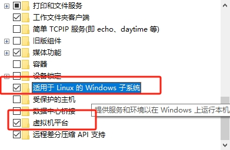
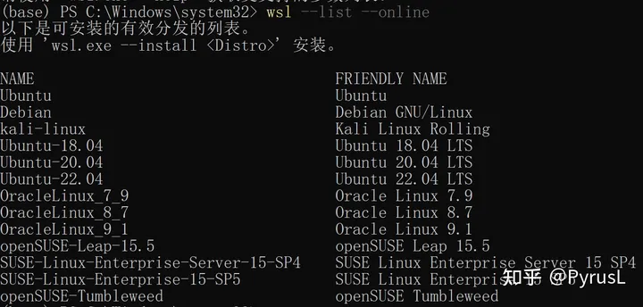

>  [参考链接](https://zhuanlan.zhihu.com/p/652537694)
## 开启电脑虚拟化选项
重启电脑进入bios选项，本机是用DEL键进入，进入后在OC配置中寻找SVM选项，把选项开启

## 开启windows功能
在搜索栏中搜索启用windows功能,开启hyper-v, 适用于Linux的windows子系统和虚拟机平台，下图所示:



## 升级wsl
**wsl2需要手动升级**: 管理员身份打开powershell，运行wsl --update升级，并运行：
```shell
wsl --set-default-version 2
```

## 安装ubuntu
```shell
 wsl --list --online
 wsl --install <名字 下图里面随便找一个ubuntu> 
```


> 如果碰见了Error code: Wsl/Service/0x8007273d, 使用管理员身份打开powershell，然后使用命令：
>  ```netsh winsock reset```
### 迁移功能
**WSL默认将ubuntu安装在系统盘，但提供了快捷的导出和迁移功能。可以根据需要进行迁移。**

依次输入以下命令，从而依次执行：
 1. 关闭当前子系统
 2. 将当前发行版导出到 D:\ubuntu22.04.tar
 3. 删除原始系统
 4. 将D:\ubuntu22.04.tar导入到新的目录 D:\Ubuntu2004 。至此完成迁移。

```shell
wsl --shutdown   
wsl --export Ubuntu-22.04 D:\ubuntu22.04.tar
wsl --unregister Ubuntu-22.04
wsl --import Ubuntu-22.04 D:\Ubuntu2004 D:\ubuntu20.04.tar
```

## 配置网络
**在wsl的终端中（vscode新建终端 或 powershell均可）输入vim ~/.bashrc， 复制下方代码到.bashrc的末尾。**

这个有VPN好用，没有VPN参考下一个
```shell
function set_proxy() {
 # 查询宿主机的IP地址
 proxy_server=`cat /etc/resolv.conf|grep nameserver|awk '{print $2}'`
 # http_proxy (局域网端口号）
 proxy_port=7890
 export http_proxy=http://$proxy_server:$proxy_port
 export HTTP_PROXY=$http_proxy
 export https_proxy=$http_proxy
 export HTTPS_PROXY=$http_proxy
}
```
***
没有VPN就用这个
```shell
export all_proxy="sock5://192.168.112.1:7890"
export ALL_PROXY="sock5://192.168.112.1:7890"
```

## neovim安装和下载
[参考链接](https://zhuanlan.zhihu.com/p/434729349?utm_id=0)
*最好选择unstable版本*

### git 配置

```shell
git config --global user.name "Your Name"
git config --global user.email "youremail@yourdomain.com"
# 查看git配置
git config --list 
# 生成本地密钥
ssh-keygen -t rsa -C "youremail@yourdomain.com" 
# 查看公钥 添加到github账号中
cat  ~/.ssh/id_rsa.pub 
# git代理配置
```

## rustup安装
```shell
curl --proto '=https'  -sSf https://sh.rustup.rs | sh
source ~/.cargo/env
```

## cargo install
```shell
# ~/.cargo/config设置
[source.crates-io]
replace-with='rsproxy'

[source.rsproxy]
registry="https://rsproxy.cn/crates.io-index"

[registries.rsproxy]
index = "https://rsproxy.cn/crates.io-index"

[net]
git-fetch-with-cli = true

```